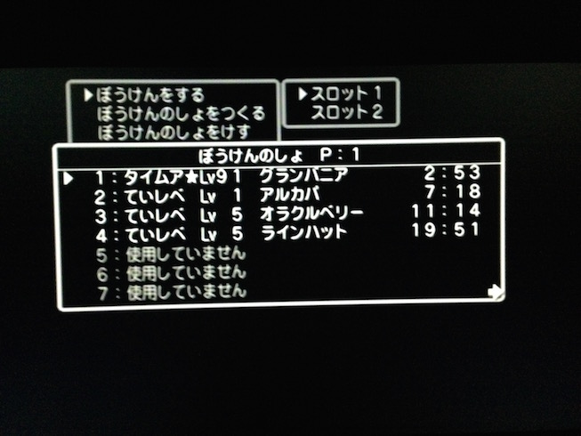

PS2版 DQ5 タイムアタック記録
====

PS2版 ドラゴンクエスト5 でゲーム内クリア時間 **2時間53分** を達成 (2007-04-21) したときのメモ。

## ゲーム詳細

#### [ドラゴンクエスト V 天空の花嫁](http://www.square-enix.co.jp/dragonquest/dqv/)

- 発売日: 2004-03-25
- プラットフォーム: プレイステーション2

## ルール

- 1分セーブを活用
	- PS2版ドラクエ5では、セーブデータに1分未満の経過時間が保存されない。この特性を利用しデータロード後1分以内にセーブを行うことで、ゲーム内時間を進めることなくストーリーを進めることができる。
- PS2実機でプレイ
- 連射機使用あり
- プログラマブルなコントローラの使用なし
- オープントレイ技 (海渡り) 不可

## 参考にした攻略法

偉大なる先人に感謝。

- [ULTIMAGARDEN](http://ultimagarden.net/dq_ta.html)
  - [ミスティ氏](http://misty.s13.xrea.com/data/dq502.html)
  - [赤ちゅん氏](http://blog.livedoor.jp/red_chun/archives/50264464.html)

## タイム一覧

|達成日|タイム|主Lv|セーブ地点|概要|備考|参考記録比較|
|:--:|:--:|:--:|:--|:--|:--|:--:|
|2006-09-20|0:00|1|オープニング|名前は「タイムア」|||
|2006-09-20|0:07|2|サンタローズ|Exp 56～63、G48～|Exp 56,52G　(おばけねずみ×4撃破)||
|2006-09-20|0:07|2|サンタローズ|下準備完了|||
|2006-09-20|0:08|2|サンタローズ|薬師救出後|||
|2006-09-20|0:09|2|アルカパ|アルカパ着|||
|2006-09-21|0:10|2|アルカパ|１分バトル準備|||
|2006-09-21|0:10|3|アルカパ|バブルスライム＋いっかくウサギ撃破|||
|2006-09-23|0:10|3|アルカパ|ビアンカLv3到達|||
|2006-09-23|0:10|5|アルカパ|ブーメラン購入|||
|2006-09-24|0:10|6|アルカパ|いばらのムチ購入|||
|2006-09-25|0:10|8|アルカパ|装備品購入完了|||
|2006-09-30|0:10|9|アルカパ|レベル上げ|Exp 3000突破||
|2006-09-30|0:10|10|アルカパ|レベル上げ|Exp 4000突破||
|2006-10-01|0:10|11|アルカパ|レベル上げ|Exp 5000突破||
|2006-10-01|0:10|11|アルカパ|レベル上げ|Exp 6000突破||
|2006-10-03|0:10|12|アルカパ|レベル上げ|Exp 7000突破||
|2006-10-03|0:10|12|アルカパ|レベル上げ|Exp 8000突破||
|2006-10-07|0:10|12|アルカパ|レベル上げ|Exp 9000突破||
|2006-10-07|0:10|13|アルカパ|レベル上げ|Exp 10000突破||
|2006-10-08|0:10|13|アルカパ|レベル上げ|Exp 11000突破||
|2006-10-08|0:10|13|アルカパ|レベル上げ|Exp 12000突破||
|2006-10-09|0:10|14|アルカパ|レベル上げ|Exp 13000突破||
|2006-10-09|0:10|14|アルカパ|レベル上げ|Exp 14000突破||
|2006-10-09|0:10|14|アルカパ|レベル上げ|Exp 15000突破||
|2006-10-10|0:10|14|アルカパ|レベル上げ|Exp 16000突破||
|2006-10-13|0:10|15|アルカパ|レベル上げ|Exp 17000突破||
|2006-10-14|0:10|15|アルカパ|レベル上げ|Exp 18000突破||
|2006-10-14|0:10|15|アルカパ|レベル上げ|Exp 19000突破||
|2006-10-14|0:10|15|アルカパ|レベル上げ|Exp 20000突破||
|2006-10-15|0:10|16|アルカパ|レベル上げ|Lv 16到達||
|2006-10-15|0:10|16|アルカパ|レヌール城準備完了|||
|2006-10-15|0:18|16|アルカパ|レヌール城攻略後|||
|2006-10-15|0:19|16|サンタローズ|サンタローズ到着|||
|2006-10-15|0:20|16|妖精の村|妖精の村到着|ベラ加入後||
|2006-10-15|0:20|16|妖精の村|ドワーフの洞窟準備完了|||
|2006-10-15|0:21|16|妖精の村|ドワーフの洞窟攻略後|||
|2006-10-15|0:21|16|妖精の村|氷の館準備完了|||
|2006-10-15|0:24|16|妖精の村|氷の館攻略後||-0:01|
|2006-10-15|0:28|16|ラインハット|ラインハット到着|||
|2006-10-15|0:29|16|ラインハット|遺跡の洞窟攻略準備完了|||
|2006-10-16|0:37|16|大神殿|幼年期終了|7分以下は無理|-0:01|
|2006-10-16|0:44|16|海辺の修道院|修道院到着|||
|2006-10-17|0:45|16|オラクルベリー|オラクルベリー到着|||
|2006-10-18|0:45|16|オラクルベリー|メダル稼ぎ|メダル 900枚到達||
|2006-10-20|0:45|16|オラクルベリー|メダル稼ぎ|メダル 100000枚到達||
|2006-10-22|0:45|16|オラクルベリー|メダル稼ぎ|メダル 200000枚到達||
|2006-10-22|0:45|16|オラクルベリー|メダル稼ぎ|メダル 300000枚到達||
|2006-10-24|0:45|16|オラクルベリー|メダル稼ぎ|メダル 400000枚到達||
|2006-10-24|0:45|16|オラクルベリー|メダル稼ぎ|メダル 500000枚到達||
|2006-10-24|0:45|16|オラクルベリー|メダル稼ぎ|メダル 600000枚到達|-0:04|
|2006-10-24|0:45|16|オラクルベリー|ヘンリーLv4到達|||
|2006-10-25|0:45|16|オラクルベリー|ヘンリーLv6到達|||
|2006-10-25|0:45|16|オラクルベリー|スラりん・ブラウン加入|||
|2006-10-28|0:45|18|アルカパ|主Lv18到達|ニトロ・アプール加入・宿屋イベント済み||
|2006-10-29|0:45|19|アルカパ|主Lv19到達|||
|2006-10-29|0:45|20|アルカパ|主Lv20到達|ドラきち・マッシュ加入||
|2006-10-29|0:45|20|サンタローズ|サンタローズ洞窟攻略前|||
|2006-10-29|0:48|20|ラインハット|ラインハット洞窟攻略前|||
|2006-10-29|0:50|20|ラインハット|ラインハット洞窟攻略・ピエール加入|||
|2006-10-30|0:51|20|オラクルベリー|スラぼう加入|||
|2006-11-01|0:51|20|アルカパ|エビアン加入|||
|2006-11-02|0:51|21|アルカパ|主Lv21到達|||
|2006-11-02|0:51|21|海辺の修道院|神の塔攻略前|||
|2006-11-02|0:53|21|ラインハット|ニセたいこう戦前|||
|2006-11-02|0:55|21|ラインハット|ニセたいこう戦後|||
|2006-11-03|0:57|21|ポートセルミ|ポートセルミ到着|||
|2006-11-03|0:57|22|ポートセルミ|主Lv22到達|マーリン・コドラン加入||
|2006-11-04|0:57|23|ポートセルミ|主Lv23到達|ドラスケ加入||
|2006-11-04|0:57|24|ポートセルミ|主Lv24到達|||
|2006-11-04|0:57|25|ポートセルミ|主Lv25到達|||
|2006-11-05|0:57|26|ポートセルミ|主Lv26到達|||
|2006-11-07|0:57|26|ポートセルミ|ホイミン加入|||
|2006-11-07|0:57|26|ルラフェン|ルラフェン到着|||
|2006-11-07|0:58|26|ルラフェン|ルラムーン草取得前|||
|2006-11-07|1:00|26|ルラフェン|ルーラ習得後|||
|2006-11-11|1:00|27|ポートセルミ|主Lv27到達|||
|2006-11-11|1:03|27|アルカパ|サラボナイベント完了|||
|2006-11-12|1:04|27|アルカパ|ジュエル加入|||
|2006-11-14|1:04|27|うわさのほこら|パペック加入|||
|2006-11-16|1:04|28|うわさのほこら|主Lv28到達|プッペ・ナオマサ加入||
|2006-11-18|1:04|29|うわさのほこら|主Lv29到達|||
|2006-11-20|1:04|30|うわさのほこら|主Lv30到達|||
|2006-11-25|1:04|31|うわさのほこら|主Lv31到達|||
|2006-11-18|1:04|32|うわさのほこら|主Lv32到達|||
|2006-12-02|1:04|32|アルカパ|死の火山準備完了|||
|2006-12-02|1:06|32|アルカパ|死の火山攻略後|||
|2006-12-02|1:06|32|山奥の村|山奥の村到着|||
|2006-12-02|1:06|32|山奥の村|滝の洞窟準備完了|||
|2006-12-02|1:11|32|アルカパ|滝の洞窟攻略後|||
|2006-12-02|1:16|32|アルカパ|結婚式後|選択はビアンカ||
|2006-12-02|1:17|32|ネッドの宿屋|ネッドの宿屋到着|||
|2006-12-02|1:17|32|ネッドの宿屋|チゾットへの山道準備完了|||
|2006-12-02|1:19|32|チゾット|チゾット到着|||
|2006-12-03|1:19|32|チゾット|グランバニアへの洞窟準備完了|||
|2006-12-03|1:21|32|ネッドの宿屋|グランバニア到着|||
|2006-12-04|1:21|33|ネッドの宿屋|主Lv33到達|オークス・マッド加入||
|2006-12-08|1:21|34|ネッドの宿屋|主Lv34到達|||
|2006-12-10|1:21|35|ネッドの宿屋|主Lv35到達|||
|2006-12-10|1:23|35|ネッドの宿屋|ビアンカ離脱イベント完了|||
|2006-12-10|1:23|35|ネッドの宿屋|試練の洞窟準備完了|||
|2006-12-10|1:26|35|ネッドの宿屋|試練の洞窟攻略完了|||
|2006-12-10|1:31|35|ネッドの宿屋|デモンズタワー準備完了|||
|2006-12-10|1:47|35|ネッドの宿屋|青年期前半終了|||
|2006-12-13|1:47|36|ネッドの宿屋|主Lv36到達|ラドンゴ・ねおゆき加入/サンチョ口笛習得||
|2006-12-16|1:47|37|ネッドの宿屋|主Lv37到達|||
|2006-12-18|1:47|38|ネッドの宿屋|主Lv38到達|ケンタス加入||
|2006-12-26|1:49|38|エルヘブン|エルヘブン到着|海の神殿でメダル入手||
|2006-12-27|1:50|38|ネッドの宿屋|アイテム収集完了|メダル計26個||
|2006-12-31|1:50|38|エルヘブン|サンダー加入|||
|2006-12-31|1:50|38|エルヘブン|オリオン加入|||
|2007-01-01|1:50|39|ネッドの宿屋|主Lv39到達|||
|2007-01-02|1:50|40|ネッドの宿屋|主Lv40到達|||
|2007-01-02|1:50|41|ネッドの宿屋|主Lv41到達|||
|2007-01-04|1:50|42|ネッドの宿屋|主Lv42到達|カイオウ加入||
|2007-01-04|1:51|42|ネッドの宿屋|妖精の村到着|妖精の森でメダル入手||
|2007-01-05|1:52|42|ネッドの宿屋|天空への塔攻略完了|||
|2007-01-05|1:52|42|海辺の修道院|地下遺跡の洞窟準備完了|||
|2007-01-05|1:54|42|地下遺跡の洞窟|地下遺跡の洞窟・教会到着|メダル入手||
|2007-01-06|1:54|43|地下遺跡の洞窟|主Lv43到達|||
|2007-01-06|1:54|44|地下遺跡の洞窟|主Lv44到達|||
|2007-01-06|1:54|45|地下遺跡の洞窟|主Lv45到達|ヘルム加入||
|2007-01-07|1:54|46|地下遺跡の洞窟|主Lv46到達|メッツ加入||
|2007-01-07|1:54|47|地下遺跡の洞窟|主Lv47到達|カブト加入||
|2007-01-07|2:01|47|ネッドの宿屋|天空城到着|||
|2007-01-07|2:02|47|妖精の城|妖精の城到着|||
|2007-01-07|2:05|47|天空城|天空城浮上完了|||
|2007-01-13|2:05|47|天空城|アイテム収集完了|ブリード・ホークス加入/メダル計32個||
|2007-01-14|2:05|48|天空城|主Lv48到達|||
|2007-01-14|2:05|49|天空城|主Lv49到達|||
|2007-01-15|2:05|50|ネッドの宿屋|主Lv50到達|||
|2007-01-18|2:05|51|天空城|主Lv51到達|||
|2007-01-19|2:05|52|天空城|主Lv52到達|||
|2007-01-20|2:05|53|ネッドの宿屋|主Lv53到達|||
|2007-01-20|2:05|54|ネッドの宿屋|主Lv54到達|||
|2007-01-21|2:05|55|天空城|主Lv55到達|||
|2007-01-21|2:05|56|ネッドの宿屋|主Lv56到達|||
|2007-01-22|2:05|57|天空城|主Lv57到達|||
|2007-01-24|2:05|58|ネッドの宿屋|主Lv58到達|||
|2007-01-25|2:05|59|天空城|主Lv59到達|||
|2007-01-26|2:05|60|天空城|主Lv60到達|||
|2007-01-26|2:05|60|サラボナ|ブオーン戦準備完了|||
|2007-01-26|2:09|60|ネッドの宿屋|ブオーン撃破完了|||
|2007-01-26|2:09|60|ネッドの宿屋|アイテム収集完了|はやぶさの剣入手||
|2007-01-27|2:09|60|天空城|ボブルの塔準備完了|||
|2007-01-27|2:10|60|天空城|ボブルの塔1Fドア開錠|||
|2007-01-27|2:10|60|天空城|ゴンズ戦準備完了|||
|2007-01-27|2:11|60|ネッドの宿屋|ゴンズ撃破完了|||
|2007-01-27|2:11|60|天空城|ゲマ戦準備完了|||
|2007-01-27|2:14|60|ネッドの宿屋|ボブルの塔攻略完了||-0:01|
|2007-01-28|2:15|60|カボチ村|大神殿準備完了|||
|2007-01-28|2:24|60|ネッドの宿屋|大神殿攻略完了|ビアンカ加入フラグON|-0:01|
|2007-01-28|2:26|60|ネッドの宿屋|ジャハンナ・エビルマウンテン到着|||
|2007-01-29|2:26|61|ネッドの宿屋|主Lv61到達|||
|2007-02-01|2:26|62|ネッドの宿屋|主Lv62到達|||
|2007-02-03|2:26|63|ネッドの宿屋|主Lv63到達|ロビン加入||
|2007-02-04|2:26|63|ネッドの宿屋|まじんのかなづち、復活の玉×2入手|||
|2007-02-10|2:26|63|ネッドの宿屋|まじんのかなづち×4、復活の玉×3入手|||
|2007-02-14|2:26|63|ネッドの宿屋|シーザー加入、復活の玉×6入手|||
|2007-02-19|2:26|63|天空城|ブルート加入|||
|2007-02-20|2:26|64|ネッドの宿屋|主Lv64到達|||
|2007-02-24|2:26|65|ネッドの宿屋|主Lv65到達|||
|2007-02-26|2:26|66|ネッドの宿屋|主Lv66到達|||
|2007-02-28|2:26|67|ネッドの宿屋|主Lv67到達|||
|2007-03-03|2:26|68|ネッドの宿屋|主Lv68到達|||
|2007-03-04|2:26|69|ネッドの宿屋|主Lv69到達|||
|2007-03-04|2:26|70|ネッドの宿屋|主Lv70到達|エミリー加入||
|2007-03-06|2:26|71|ネッドの宿屋|主Lv71到達|||
|2007-03-08|2:26|72|ネッドの宿屋|主Lv72到達|||
|2007-03-11|2:26|73|ネッドの宿屋|主Lv73到達|||
|2007-03-13|2:26|74|ネッドの宿屋|主Lv74到達|||
|2007-03-16|2:26|75|ネッドの宿屋|主Lv75到達|||
|2007-03-17|2:26|76|ネッドの宿屋|主Lv76到達|||
|2007-03-17|2:26|77|ネッドの宿屋|主Lv77到達|||
|2007-03-18|2:26|77|ネッドの宿屋|ブルートLv30到達|||
|2007-03-21|2:26|77|エルヘブン|力の種入手目標まで残り10個|||
|2007-03-24|2:26|77|エルヘブン|力の種入手完了|デッカー加入||
|2007-03-25|2:26|77|ネッドの宿屋|力の種投与完了|ゴレムス・サンダー・オリオン・ブルート力MAX||
|2007-03-27|2:26|78|ネッドの宿屋|主Lv78到達|||
|2007-04-01|2:26|79|ネッドの宿屋|主Lv79到達|||
|2007-04-03|2:26|80|ネッドの宿屋|主Lv80到達|||
|2007-04-06|2:26|81|ネッドの宿屋|主Lv81到達|||
|2007-04-07|2:26|82|ネッドの宿屋|主Lv82到達|||
|2007-04-08|2:26|83|ネッドの宿屋|主Lv83到達|||
|2007-04-08|2:26|84|ネッドの宿屋|主Lv84到達|ギーガ加入||
|2007-04-12|2:26|85|ネッドの宿屋|主Lv85到達|||
|2007-04-12|2:26|86|ネッドの宿屋|主Lv86到達|ジャイン加入||
|2007-04-14|2:26|87|ネッドの宿屋|主Lv87到達|||
|2007-04-14|2:26|88|ネッドの宿屋|主Lv88到達|||
|2007-04-15|2:26|89|ネッドの宿屋|主Lv89到達|はぐりん加入||
|2007-04-15|2:26|90|ネッドの宿屋|主Lv90到達|||
|2007-04-15|2:26|91|ネッドの宿屋|主Lv91到達|||
|2007-04-16|2:26|91|ネッドの宿屋|ケンタスLv50到達|||
|2007-04-21|2:26|91|ネッドの宿屋|エビルマウンテン準備完了|||
|2007-04-21|2:53|91|グランバニア|ゲームクリア||-0:03|

参考記録比較: [赤ちゅん氏の記録](http://blog.livedoor.jp/red_chun/archives/50279231.html) (ラップライム) との差分

## 工夫

- アルカパで主人公をLv.16まで育てる (-0:02)
- カジノは大当たりを狙わず中当たりを繰り返し、ノータイムで 60万コインを稼ぐ (-0:04)
- ゴーレム3匹&はやぶさの剣をGetしたことでボブルの塔、大神殿の時間短縮 (-0:02)
    - 天空への塔のメダルはタイムロスになるので取れない 
- ラストバトルはケンタラウス+力Maxのゴーレム3匹+ソルジャーブルで総力戦 (-0:03)
    - ジャハンナ到着後すぐにエビルマウンテンまで行き、ルーラ登録   

